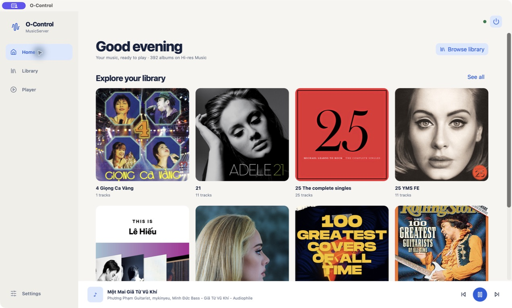
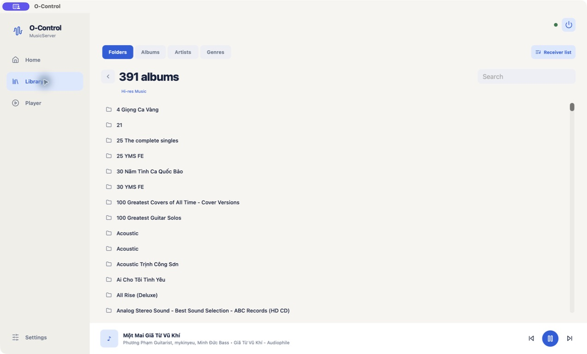
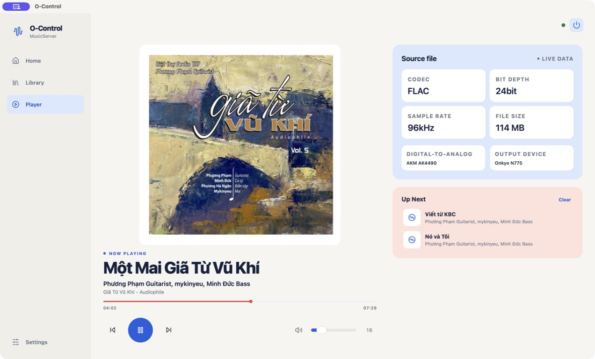
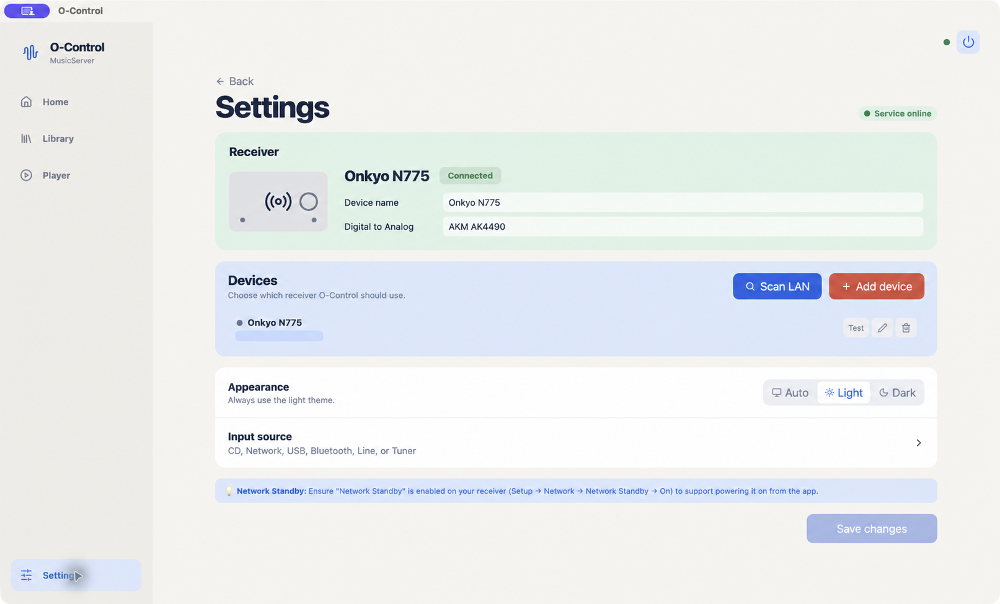

# O-Control

**Ứng dụng macOS mã nguồn mở để quản lý Music Server và điều khiển thiết bị âm thanh mạng.**

O-Control giúp người dùng duyệt thư viện nhạc DLNA/UPnP, phát nhạc và điều khiển
receiver ngay trên macOS. Phiên bản hiện tại tập trung vào Onkyo và đã được kiểm
thử thực tế với Onkyo CR-N775/N775. Mục tiêu dài hạn của dự án là mở rộng sang
các model Onkyo khác và thiết bị của nhiều hãng âm thanh khác.

> [!IMPORTANT]
> O-Control đang ở giai đoạn phát triển sớm. Hiện chỉ Onkyo CR-N775/N775 được
> kiểm thử trên thiết bị thật; các model hoặc thương hiệu khác chưa được bảo đảm
> tương thích.

## Ảnh chụp ứng dụng

### Home



### Library



### Player



### Settings



## Tính năng

### Quản lý Music Server

- Tự động tìm Music Server tương thích DLNA/UPnP trong mạng nội bộ.
- Duyệt thư mục, album, nghệ sĩ và danh sách bài hát.
- Phát một bài hoặc một danh sách bài qua receiver.
- Hiển thị hàng đợi và các bài sắp phát (Up Next).
- Hiển thị metadata, thời lượng, định dạng âm thanh, kích thước file và ảnh bìa
  khi Music Server hoặc receiver cung cấp dữ liệu.
- Tự động chuyển bài trong hàng đợi DLNA.

### Điều khiển receiver

- Bật/tắt nguồn, tăng giảm âm lượng và mute.
- Chọn nguồn CD, Network, USB, Bluetooth, Line hoặc Tuner.
- Play, pause, stop, previous và next.
- Hiển thị trạng thái và thông tin Now Playing theo thời gian thực.
- Quét receiver Onkyo trong LAN hoặc thêm thủ công bằng IP/hostname.
- Lưu nhiều cấu hình thiết bị và chọn thiết bị đang sử dụng.
- Chạy các preset thao tác nhanh.

### Trải nghiệm macOS

- Ứng dụng native dựa trên Tauri, React và TypeScript.
- Chạy ở menu bar, đóng cửa sổ nhưng vẫn tiếp tục hoạt động ở tray.
- Local service được đóng gói cùng ứng dụng, không cần chạy server thủ công.
- Global shortcuts cho âm lượng, mute, play/pause và hiện/ẩn cửa sổ.
- Giao diện sáng, tối hoặc tự động theo thiết lập của macOS.
- Không yêu cầu dịch vụ cloud; việc điều khiển diễn ra trong mạng nội bộ.

## Khả năng tương thích

| Thành phần | Trạng thái |
| --- | --- |
| macOS trên Apple Silicon (`arm64`) | Hỗ trợ hiện tại |
| Onkyo CR-N775/N775 | Đã kiểm thử với thiết bị thật |
| Music Server DLNA/UPnP | Hỗ trợ; kết quả phụ thuộc metadata và khả năng của server |
| Receiver Onkyo/Integra dùng eISCP | Có thể tương thích một phần, chưa được kiểm thử |
| Mac Intel (`x86_64`) | Chưa có bản build |
| Thiết bị của hãng khác | Chưa hỗ trợ, nằm trong roadmap |

O-Control giao tiếp với receiver Onkyo bằng giao thức eISCP qua TCP port
`60128`. Mã nguồn hiện có một số giả định và mã input dành riêng cho CR-N775,
vì vậy không nên xem mọi thiết bị eISCP là đã được hỗ trợ.

## Kiến trúc

```text
┌──────────────────────────────────────────┐
│ O-Control for macOS                      │
│ Tauri + React                            │
└───────────────────┬──────────────────────┘
                    │ HTTP + WebSocket (localhost)
┌───────────────────▼──────────────────────┐
│ O-Control local service                  │
│ Fastify + state store + playback queue   │
└──────────────┬──────────────────┬────────┘
               │                  │
       TCP eISCP :60128       SSDP / UPnP
               │                  │
┌──────────────▼──────────┐  ┌────▼─────────────────┐
│ Onkyo receiver          │  │ DLNA Music Server    │
└─────────────────────────┘  └──────────────────────┘
```

Ứng dụng desktop khởi động một service chạy cục bộ. Service này quản lý kết nối
TCP tới receiver, tìm và duyệt Music Server, duy trì state/hàng đợi, sau đó gửi
cập nhật thời gian thực cho giao diện qua WebSocket.

## Bắt đầu sử dụng

### Chuẩn bị receiver

1. Kết nối Mac, receiver và Music Server vào cùng một mạng LAN.
2. Bật **Network Standby** trên receiver.
3. Nên đặt IP tĩnh hoặc DHCP reservation cho receiver.
4. Đảm bảo firewall không chặn eISCP TCP port `60128` và lưu lượng DLNA/UPnP
   trong mạng nội bộ.

### Build ứng dụng macOS

Yêu cầu:

- macOS trên Apple Silicon.
- Node.js 20 trở lên và npm.
- Bun 1.3 trở lên để đóng gói service runtime arm64.
- Rust toolchain với `cargo`.
- Xcode Command Line Tools.

Cài dependencies và build:

```bash
npm install
npm run build:app
```

File `.app` và `.dmg` được tạo tại:

```text
apps/desktop/src-tauri/target/aarch64-apple-darwin/release/bundle/
```

Hiện dự án chưa cung cấp artifact cho Mac Intel và chưa mô tả quy trình ký/notarize
ứng dụng để phân phối rộng rãi.

### Thiết lập lần đầu

1. Mở O-Control.
2. Vào **Settings** → **Devices**.
3. Chọn **Scan LAN** để tìm receiver Onkyo, hoặc **Add device** để nhập IP và
   port thủ công.
4. Lưu thiết bị, chọn thiết bị đang dùng và bấm **Test** để kiểm tra kết nối.
5. Mở **Library** để chọn Music Server và duyệt thư viện nhạc.

## Phát triển

Cài dependencies:

```bash
npm install
```

Chạy ứng dụng Tauri trong chế độ development:

```bash
npm run tauri:dev -w @o-control/desktop
```

Chạy service với receiver thật:

```bash
ONKYO_HOST=192.168.1.104 \
ONKYO_PORT=60128 \
O_CONTROL_PORT=8787 \
MOCK_MODE=false \
npm run dev:service
```

Chạy service không cần phần cứng:

```bash
MOCK_MODE=true npm run dev:service
```

Chạy bản browser preview của desktop UI:

```bash
npm run dev -w @o-control/desktop -- --host 127.0.0.1
```

Sau đó mở `http://127.0.0.1:5173/`.

Service mặc định chỉ bind vào `127.0.0.1`. Có thể chủ động dùng một interface
khác, ví dụ `O_CONTROL_HOST=0.0.0.0`, nhưng không nên mở service ra Internet hoặc
mạng không tin cậy.

## Kiểm thử

Chạy unit test của tất cả workspace:

```bash
npm test
```

Chạy integration test với mock receiver:

```bash
npm run test:integration
```

Chạy toàn bộ quy trình kiểm tra không cần phần cứng:

```bash
npm run verify:agent
```

`verify:agent` thực hiện type-check, unit/UI/integration test, production build,
kiểm tra Tauri Rust shell và smoke test service ở mock mode. Kiểm thử với receiver
thật vẫn được khuyến nghị trước mỗi bản phát hành.

## Cấu trúc repository

```text
apps/desktop/          Ứng dụng macOS Tauri và giao diện React
apps/raycast/          Raycast extension tùy chọn
apps/web/              Web debug console tùy chọn
packages/eiscp/        Xây dựng và phân tích packet Onkyo eISCP
packages/service/      Local API, receiver client và Music Server orchestration
packages/shared/       Kiểu dữ liệu và command dùng chung
packages/upnp/         Tìm kiếm, duyệt và phát nội dung DLNA/UPnP
tools/mock-receiver/   Receiver TCP giả lập phục vụ kiểm thử
tests/integration/     Integration test của service
infra/docker/          Cấu hình container tùy chọn
docs/                  Tài liệu kỹ thuật, thiết kế và kế hoạch
```

Đây là npm monorepo; các package dùng chung được quản lý qua npm workspaces.

## Local Service API

API này chủ yếu phục vụ ứng dụng desktop và được thiết kế để chạy trên localhost.

| Endpoint | Method | Chức năng |
| --- | --- | --- |
| `/health` | `GET` | Kiểm tra service |
| `/state` | `GET` | Lấy toàn bộ state của receiver |
| `/events` | `WS` | Stream state theo thời gian thực |
| `/commands/power` | `POST` | Điều khiển nguồn |
| `/commands/volume` | `POST` | Điều khiển âm lượng |
| `/commands/mute` | `POST` | Điều khiển mute |
| `/commands/input` | `POST` | Chọn input |
| `/commands/playback` | `POST` | Điều khiển phát nhạc |
| `/presets` | `GET` | Danh sách preset |
| `/presets/:id/run` | `POST` | Chạy preset |
| `/dlna/servers` | `GET` | Danh sách Music Server đã tìm thấy |
| `/dlna/scan` | `POST` | Yêu cầu quét DLNA/UPnP |
| `/dlna/browse` | `POST` | Duyệt nội dung trên Music Server |
| `/music/catalog` | `GET` | Lấy catalog album/nghệ sĩ đã chuẩn hóa |
| `/dlna/artwork` | `GET` | Proxy ảnh bìa từ Music Server |
| `/dlna/play` | `POST` | Phát bài hoặc playlist qua receiver |

## Giới hạn hiện tại

- Mới chỉ kiểm thử đầy đủ với một model receiver Onkyo trong một số cấu hình
  mạng/Music Server thực tế.
- Chất lượng metadata, ảnh bìa và cấu trúc thư viện phụ thuộc Music Server.
- Chưa hỗ trợ multi-zone.
- Chưa có cơ chế plugin/adapter hoàn chỉnh cho các hãng khác.
- Chưa có automatic release, code signing và notarization cho macOS.

## Roadmap

- Kiểm thử và bổ sung profile cho nhiều model Onkyo/Integra hơn.
- Tách lớp giao tiếp thiết bị thành adapter để hỗ trợ thêm các hãng khác.
- Cải thiện khả năng tương thích với nhiều Music Server DLNA/UPnP.
- Bổ sung multi-zone và quản lý nhiều thiết bị đồng thời.
- Cung cấp bản build đã ký cho macOS và cân nhắc hỗ trợ Mac Intel.

Roadmap có thể thay đổi theo phản hồi và đóng góp của cộng đồng.

## Đóng góp

Issue, bug report, tài liệu kiểm thử thiết bị và pull request đều được chào đón.
Đặc biệt hữu ích là thông tin về model receiver, firmware, Music Server và log
giao thức có thể tái hiện lỗi.

Quy trình đề xuất:

1. Tạo issue mô tả vấn đề hoặc đề xuất trước khi thực hiện thay đổi lớn.
2. Fork repository và tạo branch riêng cho thay đổi.
3. Giữ thay đổi tập trung, bổ sung test khi phù hợp.
4. Chạy `npm test`, `npm run test:integration` hoặc `npm run verify:agent`.
5. Tạo pull request, ghi rõ cách kiểm thử và thiết bị đã dùng.

Không đưa IP công khai, thông tin mạng nội bộ, token hoặc dữ liệu cá nhân vào
issue, log và pull request.

## Bảo mật

O-Control điều khiển thiết bị thật trong mạng nội bộ. Không expose local service
ra Internet và chỉ chạy ứng dụng trên mạng tin cậy. Nếu phát hiện lỗ hổng bảo
mật, vui lòng không công bố thông tin khai thác hoặc dữ liệu nhạy cảm trong một
issue công khai; hãy liên hệ maintainer bằng kênh riêng trước khi disclosure.

## Giấy phép

Dự án được định hướng phát hành theo giấy phép MIT. Trước khi public repository,
cần bổ sung file `LICENSE` với thông tin chủ sở hữu bản quyền phù hợp.

## Tuyên bố thương hiệu

O-Control là dự án độc lập, không phải sản phẩm chính thức và không được Onkyo
hoặc các hãng thiết bị khác tài trợ hay chứng thực. Onkyo, Integra và các tên
thương hiệu liên quan thuộc về chủ sở hữu tương ứng.
